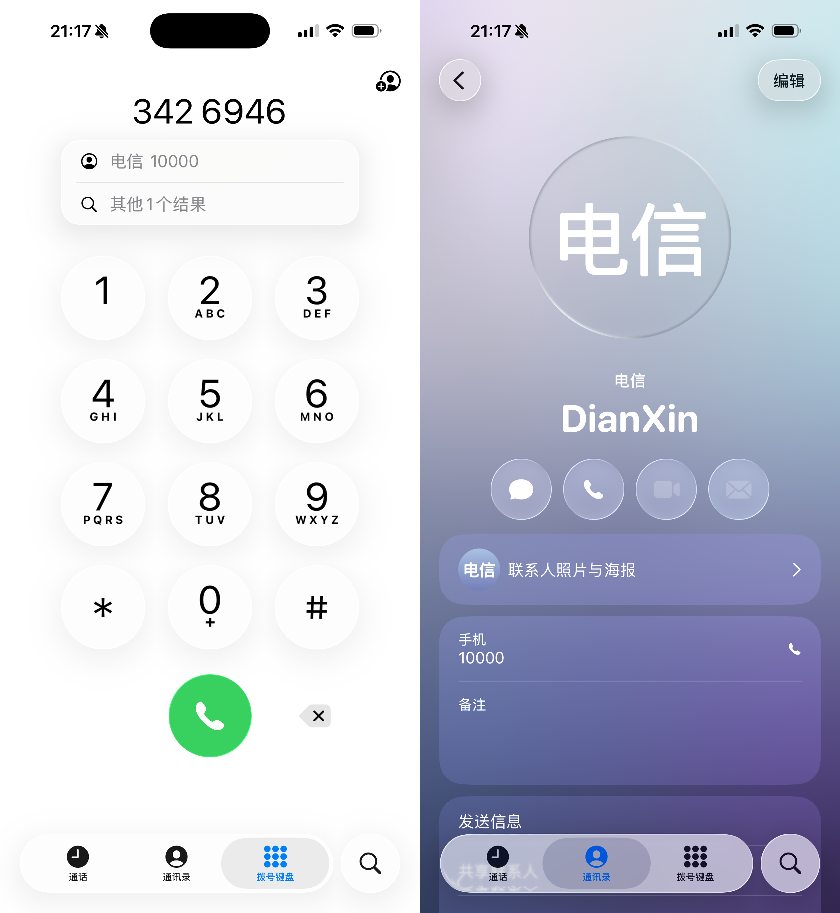
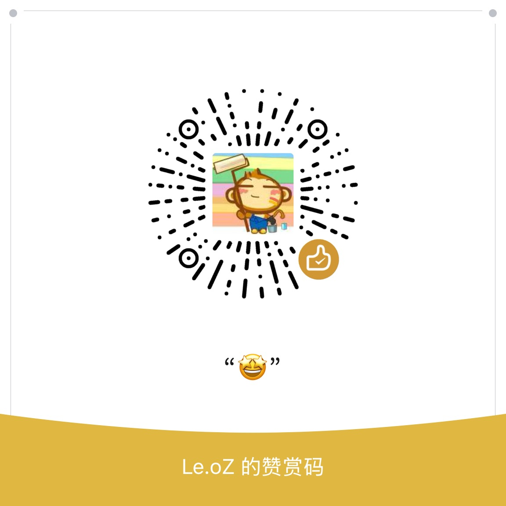

PhoneticGenerator for Apple T9 Dialer
=========

> 本项目源于 [iPhoneContactSort](https://github.com/SweenEy1130/iPhoneContactSort)，在 python 3+ 下进行适配，修改部分 bug，并增加使用说明。

PhoneticGenerator 是一个 Python 脚本，旨在从 Apple 的 VCF 联系人文件中提取联系人的姓和名，并将它们转换为拼音格式。该脚本将转换后的拼音添加到 NICKNAME 字段中，以便在 iPhone/Mac 上显示联系人名称的拼音，允许 iPhone T9 拨号。

## 功能

- 给中文通讯录增加拼音标注。
- 在英文系统下，允许 macOS/iOS 对中文名片进行排序。
- iPhone 电话原生支持 T9 拨号

## 环境要求

- Python 3.x

## 使用说明

### 步骤 1：从 macOS/iOS 的联系人导出 VCF 文件

1. 在 macOS 上导出 VCF 文件：

    打开 联系人 应用。

    在左侧栏选择你要导出的联系人（可以选择一个群组或全部联系人）。

    点击菜单栏中的 文件 > 导出 > 导出 vCard。

    选择保存位置并保存 VCF 文件。

2. 在 iOS 上导出 VCF 文件：

    打开 联系人 应用。

    选择一个联系人，点击右上角的 分享 按钮。

    选择 邮件 或 信息，将联系人以 vCard 格式发送给自己。

    打开邮件或信息，并下载 vCard 文件。

### 步骤 1.5：强烈建议用 Google/Gmail 通讯录 导入 + 导出 处理一次步骤 1 导出的 VCF 文件

**否则 iCloud 网页端最终导入可能会报错！！！**

### 步骤 2：运行 iPhoneContactSort 脚本

将导出的 *.vcf 文件放在脚本的同一目录下，或者修改传入的文件路径指向正确的位置。

使用命令行进入脚本所在目录：

```
cd /path/to/your/script
```

运行脚本：

```
python main.py [你的 *.vcf 文件路径]
```

脚本会读取 *.vcf 文件，提取联系人信息并生成拼音，最后将转换后的结果写回到同一文件中。

运行完成后，原始的 *.vcf 文件会被修改并包含新的 NICKNAME 字段。例如：

```
BEGIN:VCARD
VERSION:3.0
PRODID:-//Apple Inc.//macOS 15.2//EN
N:测;试;;;
NICKNAME:CeShi
FN:试 测
EMAIL;type=INTERNET;type=pref:test@gmail.com
TEL;type=HOME;type=VOICE;type=pref:9110
END:VCARD
```

### 步骤 2.5：强烈建议分段生成的 VCF 文件，单个 VCF 文件最好不超过 400 个联系人

**否则 iCloud 网页端最终导入可能会报错！！！**

### 步骤 3：导入更新后的 VCF 文件

**首先务必备份现有通讯录！！！**

1. 在 macOS 上导入 VCF 文件：

    直接双击修改后的 contacts.vcf 文件，按照提示导入并更新联系人。

    新的联系人信息将被导入并显示在联系人列表中。

2. 在 iOS 上导入 VCF 文件：

    将修改后的 VCF 文件通过 邮件 或 AirDrop 发送到 iPhone。

    打开邮件或文件，并点击文件旁边的 共享 按钮。

    选择 添加到联系人，然后选择要更新的联系人或创建新的联系人。

3. 在 iCloud 网页端导入 VCF 文件：

    可行，但不推荐，容易保存，猜测是网络因素。

## 注意事项

备份原始文件：在运行脚本之前，建议先备份原始的 VCF 文件，以防止文件损坏或丢失数据。

编码问题：确保 VCF 文件使用 UTF-8 编码，否则可能导致中文字符无法正确处理。

拼音转换准确性：该脚本依赖于[原项目](https://github.com/SweenEy1130/iPhoneContactSort)中编写的 pinyin 库来生成拼音，拼音的准确性可能会受到库本身支持的影响。

## Original Author / Collaborator

👤 Original Author: **coolmoon327** 

* Github: [@coolmoon327](https://github.com/coolmoon327)

## Show your support

Give a ⭐️ if this project helped you!

## 📝 License

Copyright © 2024 [@coolmoon327](https://github.com/coolmoon327).<br/>
This project is [MIT License](https://mit-license.org/)licensed.

## 效果图



## ☕ 请我喝杯咖啡

如果这个项目对你有帮助，欢迎请我喝杯咖啡，感谢支持！

### 赞赏码


